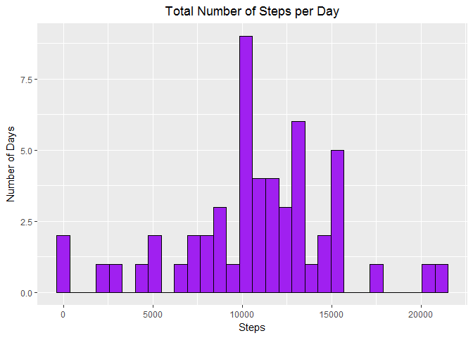
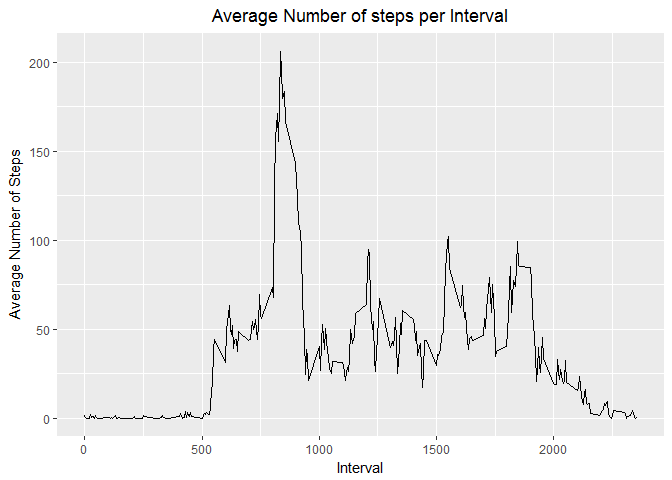
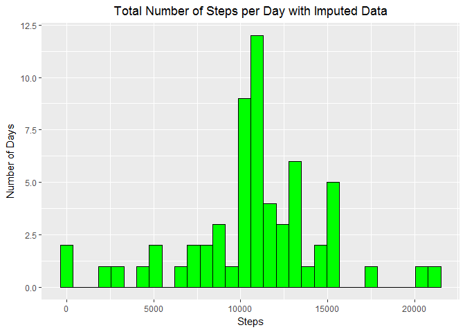
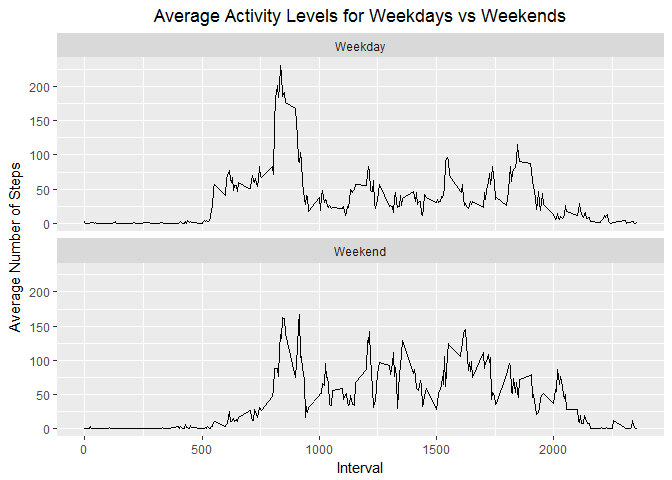

Course Project 1
================

### Cleaning and processing data from fitness devices.

Loading and Preparing the Data

``` r
#read in rawData, declare a variable with NA's removed for later calculations
rawData <- read.csv("activity.csv")
compCases <- rawData[complete.cases(rawData),]
```

Mean and median values for the total number of steps taken per day.

``` r
#sum total number of steps by date
totalSteps <- compCases %>% group_by(date) %>% mutate(sumsteps = sum(steps)) %>% 
        select(date, sumsteps)
totalSteps1 <- totalSteps[!duplicated(totalSteps),]
summary(totalSteps1$sumsteps, digits = 8)
```

    ##     Min.  1st Qu.   Median     Mean  3rd Qu.     Max. 
    ##    41.00  8841.00 10765.00 10766.19 13294.00 21194.00

``` r
#plot histogram for total steps per day
ggplot(totalSteps1, aes(sumsteps)) + geom_histogram(bins=30, color="black", fill="purple") +
    labs(x="Steps", y = "Number of Days", 
         title = "Total Number of Steps per Day") +
    theme(plot.title=element_text(hjust=.5)) 
```



Average daily activity pattern

``` r
#calculate and plot average activity per 5 minute interval
avgPerDay <- compCases %>% group_by(interval) %>% mutate(avgsteps = mean(steps)) %>%
            select(interval, avgsteps)
avgPerDay1 <- avgPerDay[!duplicated(avgPerDay),]

ggplot(avgPerDay, aes(x=interval, y= avgsteps)) + geom_line() +
    labs(x ="Interval", y ="Average Number of Steps", title="Average Number of steps per Interval") +
    theme(plot.title = element_text(hjust=.5))
```



``` r
#determine interval with max avg steps
maxInterval <- avgPerDay1[avgPerDay1$avgsteps == max(avgPerDay1$avgsteps),]
print(paste("The 5 minute interval with the highest average number of maximum steps is interval",
          maxInterval[1,1], "with", round((maxInterval[1,2]), digits=1), "steps"))
```

    ## [1] "The 5 minute interval with the highest average number of maximum steps is interval 835 with 206.2 steps"

### Imputing missing values

Missing values were imputed by taking the mean value for the interval being calculated.

``` r
#calculate number of NA's in data
missingData <- sum(is.na(rawData))
missingSteps <- sum(is.na(rawData$steps))
if (missingData == missingSteps) {
    print(paste("The total number of missing values found in the data is ", missingSteps))
}
```

    ## [1] "The total number of missing values found in the data is  2304"

``` r
#create table for mean steps by interval
intervalAvgs <- melt(tapply(compCases$steps, compCases$interval, mean))

#test for NA's in rawData$steps and replace with interval mean if TRUE
naIndex <- is.na(rawData$steps)

imputed <- rawData
#test rows for NA's in 'step variable', get interval ID, match to average value for that ID
#in intervalAvgs then replace missing value
for (i in 1:dim(rawData)[1]) {
    if (naIndex[i] == TRUE) {
        intervalId <- rawData[i,"interval"]                 
        matchInterval <- intervalId == intervalAvgs$Var1    
        replacement <- intervalAvgs[matchInterval,2]       
        imputed[i,"steps"] <- replacement                   
                                                                
    }
}

totalStepsImputed <- imputed %>% group_by(date) %>% mutate(sumsteps = sum(steps)) %>%
        select(date, sumsteps)
totalStepsImputed1 <- totalStepsImputed[!duplicated(totalStepsImputed),]

ggplot(totalStepsImputed1, aes(sumsteps)) + geom_histogram(bins=30, color="black", fill="green") +
    labs(x="Steps", y = "Number of Days", 
         title = "Total Number of Steps per Day with Imputed Data") +
    theme(plot.title=element_text(hjust=.5)) 
```



``` r
summary(totalStepsImputed$sumsteps, digits = 8)
```

    ##     Min.  1st Qu.   Median     Mean  3rd Qu.     Max. 
    ##    41.00  9819.00 10766.19 10766.19 12811.00 21194.00

Imputing the values resulted in a an increase of approximately 10 steps in the mean and 11 steps in the median comprared to the raw data. This is, relatively, a small increase accounting for a positive difference of about a .1%.

Difference in activty: Weekdays vs Weekends

``` r
dayTest <- function (day) {
    if (day == "Saturday" || day == "Sunday") {
        day <- "Weekend"
    } else {
        day <- "Weekday"
    }
}

week <- imputed %>% mutate(date = as.POSIXct(date), dayofweek = weekdays(date))


wknds <- sapply(week$dayofweek, dayTest)
week <- cbind(week, wknds)
week1 <- week %>% group_by(interval, wknds) %>% mutate(avgsteps = mean(steps))

ggplot(week1, aes(interval,avgsteps)) + geom_line() + facet_wrap( ~ wknds, ncol = 1 ) +
    labs(x="Interval", y = "Average Number of Steps", 
         title = "Average Activity Levels for Weekdays vs Weekends") +
    theme(plot.title=element_text(hjust=.5)) 
```



Weekends were found to have both a higher mean and median number of steps compared to weekdays.

``` r
tapply(week1$avgsteps, wknds, summary)
```

    ## $Weekday
    ##    Min. 1st Qu.  Median    Mean 3rd Qu.    Max. 
    ##   0.000   2.247  25.800  35.610  50.850 230.400 
    ## 
    ## $Weekend
    ##    Min. 1st Qu.  Median    Mean 3rd Qu.    Max. 
    ##   0.000   1.241  32.340  42.370  74.650 166.600
